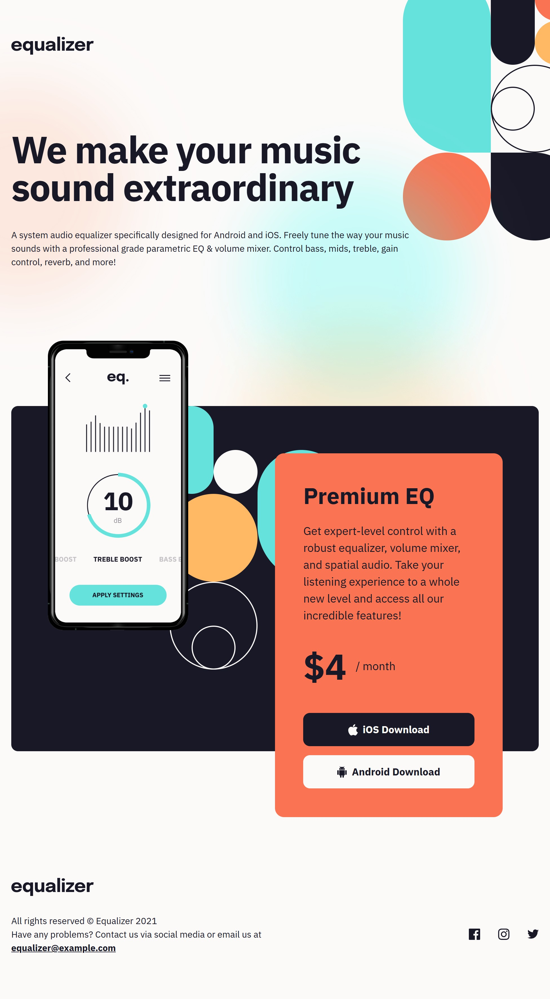

# Equalizer landing page

My solution to the [Equalizer landing page challenge](https://www.frontendmentor.io/challenges/equalizer-landing-page-7VJ4gp3DE) on Frontend Mentor.

- Live site: [link](https://my-fm-challenges.github.io/equalizer-landing-page/)
- Solution: [link](https://github.com/my-fm-challenges/equalizer-landing-page)

## Built with

- Semantic HTML
- CSS Grid and Flexbox
- Custom properties, `clamp()` for fluid sizing
- `@layer` for the reset, CSS nesting
- BEM, logical properties, mobile-first
- SVG sprite for icons

## What I learned

- **Overlap without extra markup.** The dark panel behind the phone is a `::before` placed in the same grid cell as the phone and the card. The overhang is just a margin on the pseudo-element.
- **Where variables belong.** Design tokens go in `:root`, values used by one block live in that block.
- **`gap` vs margin.** `column-gap` is the same for every column. When the design has one uneven gap, a margin is the honest choice.
- **Footer semantics.** `<address>` for contact info, `<small>` for the copyright line.
- **`text-wrap: balance`** keeps a big heading from leaving one word on the last line.

## AI collaboration

I wrote all the code myself and used Claude as a reviewer: it checked the markup and CSS against a checklist and explained what to fix and why. Most useful part: catching duplicates and leftover comments I'd stopped noticing.

## Author

- Frontend Mentor: [@kuksinskiy](https://www.frontendmentor.io/profile/kuksinskiy)